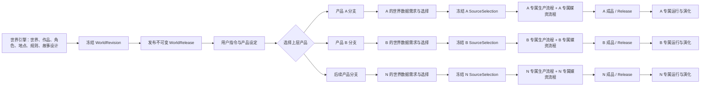
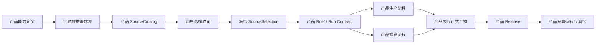

# StoryForge 世界引擎到多产品开发总纲

> 文档状态：项目级流程总纲（Authoritative）  
> 版本：1.0  
> 生效日期：2026-08-22  
> 适用范围：所有从 StoryForge 世界引擎派生跑团、角色聊天、文字游戏、AVG、开放世界、叙事模拟及后续新产品的功能分支  
> 核心原则：**先冻结共同来源，再由产品分支确定并冻结自己需要的世界数据，之后才开始该产品自己的生产、媒资、发布与演化流程。**

本文只治理各产品共同经过的项目级边界，不替各产品设计内部生产流程。各产品的功能、数据表、
生产编排、媒资生产、运行与演化均由对应分支独立建设；当前阶段不强行抽成一套共用产品流程。

---

## 1. 总体裁定

StoryForge 的整体形态是“一个世界引擎，多个上层产品”。世界引擎维护可继续编辑的世界与作品
设定；产品不直接绑定这些持续变化的工作表，而从一个不可变的世界发布版本出发。

用户在选定该来源版本后发出产品指令、补充产品设定并选择目标产品。**从这里开始分支。** 每个
产品分支的第一个正式步骤不是立即生成内容，而是回答：

> 为完成这一次产品生产，我需要冻结版本中的哪些世界数据，为什么需要，选取到什么粒度？

答案形成产品专属的“世界数据需求 + 来源选择契约”。只有该契约完成选择、校验并冻结后，产品
分支才能进入自己的 Brief、功能表、生产推演、媒资生产、成品发布和专属运行演化。



这里的 A、B、N 不是共享生产框架的不同参数，而是彼此独立的产品边界。各分支可以有完全不同
的数据结构、AI 契约、生产步骤、媒资种类、验证规则和运行方式。

---

## 2. 当前世界引擎的正式数据出口

### 2.1 唯一正式出口

当前主线中，跨越“世界引擎 → 上层产品”边界的正式来源是：

```text
WorldRevision
  └─ publishWorldRevision()
       └─ WorldRelease
            └─ manifestJson: WorldReleaseManifestV2
```

- `WorldRevision` 是创建时冻结并经过内容哈希校验的候选修订。
- `WorldRelease` 是发布后的不可变版本，提供 `id`、`version`、`contentHash`、
  `sourceWorldCode` 和 `manifestJson`。
- `WorldReleaseManifestV2` 是产品实际读取的便携世界包，不依赖当前浏览器数据库的本地数字 ID。
- 产品必须绑定明确的 `worldReleaseId + contentHash`，不得用“当前世界最新数据”作为隐式来源。

权威实现：

- [`src/lib/types/world-release.ts`](../src/lib/types/world-release.ts)
- [`src/lib/world-engine/releases.ts`](../src/lib/world-engine/releases.ts)
- [`src/lib/registry/project-tables.ts`](../src/lib/registry/project-tables.ts)

### 2.2 出口内容契约

`WorldReleaseManifestV2` 当前包含：

| 字段 | 含义 | 产品侧用途 |
|---|---|---|
| `schema` / `version` | 世界包协议及版本 | 拒绝未知协议，驱动迁移或适配 |
| `worldCode` / `worldName` / `workTitle` | 来源世界及当前作品的人类可读身份 | 展示、审计，不代替稳定引用 |
| `selectedTables` | 本次世界发布实际包含的表 | 判断数据是否存在，不得假定所有表都有 |
| `selectedNarrativeModules` | 作者选择并验证过的叙事模块身份 | 供确实需要叙事蓝图的产品选择 |
| `dependencies` | 每张表的记录数和内容哈希 | 完整性、重放和审计 |
| `records` | 按表名组织的便携记录 | 产品分支进行二次选择的主要数据池 |
| `portableProject` | 严格 v4 的便携项目快照及 World/Work 所有权 | 解析作用域、便携引用和根身份 |

产品引用 `records` 中的对象时，必须保存导出包中的便携引用（例如 `_exportId` 及其重映射字段），
不得把来源浏览器里的 Dexie 自增 ID 保存成跨产品、跨导入的长期身份。

虽然 `WorldRelease` 记录以 World 为发布序列，但发布包由创建时的精确 `Project / World / Work`
作用域生成；当前 Work 的便携身份位于 `portableProject.ownership` 和对应根记录中。产品适配器应从
Manifest 解析并校验该身份，不能把一个 Release 理解成脱离 Work 语境的全世界无差别数据池。

### 2.3 当前可进入世界发布包的数据目录

该目录由 `PROJECT_TABLES` 中 `communityShare: 'world'` 与 `releaseSection` 动态派生；注册表才是
单一事实源，下面是本总纲生效时的主线快照。`worldReleases` 本身不会递归装入发布包。

| 发布区段 | 当前表 | 说明 |
|---|---|---|
| `foundation` 世界基础 | `codexCategories`, `codexEntries`, `cultivationSystems`, `geographies`, `historicalKeywords`, `historicalTimelineEvents`, `histories`, `importantLocations`, `powerSystems`, `worldGroupLinks`, `worldGroups`, `worldNodes`, `worldRulesProfiles`, `worldviews` | 自然、人文、规则、地点、词条和世界结构 |
| `characters` 角色资产 | `characterRelations`, `characters`, `workCharacterBindings` | 角色主档、关系和本作品中的角色绑定 |
| `narrative` 故事设计及当前产品资产 | `adventureModules`, `avgMediaAssets`, `avgMediaBlobs`, `avgPresentationModules`, `gameDefinitions`, `interactionCharacterProfiles`, `interactionSceneTemplates`, `narrativeBeats`, `narrativeChoices`, `narrativeModules`, `narrativeNodes`, `narrativeSimulationModules`, `openWorldModules`, `storyArcs`, `storyCores` | 故事核心、叙事图，以及已存在产品写入发布目录的资产 |
| `outline` 大纲与细纲 | `detailedOutlines`, `outlineNodes` | 卷纲、章纲和场景级细纲，不含正文 |

当前构建器还会把 `narrativeModules`、`narrativeNodes`、`narrativeBeats`、`narrativeChoices`
加入 `selectedTables`，再按作者明确选择的 NarrativeModule 过滤对应记录；没有选择模块时，这几张
表可以存在于目录但没有产品可用内容。产品仍须检查实际记录与选择，不得只看表名判断数据充足。

必须注意：**“可以进入世界发布包”不等于“每个产品都应该读取”。** 特别是 `narrative` 区段目前
包含若干既有产品资产。新产品不得因为它们已经位于发布包中，就把另一产品的表当成通用世界
事实或自己的默认依赖；应在本产品的数据需求声明中显式选用或排除。

### 2.4 当前出口不是什么

`WorldReleaseManifestV2` 是可验证的便携表快照，不是已经替所有产品整理好的统一领域对象。因此：

- 它不是统一 `ProductBrief`。
- 它不是统一生产 DAG。
- 它不是统一媒资 Profile 或统一素材表。
- 它不替产品判断应选哪些角色、地点、规则、叙事或既有素材。
- 它不允许产品绕过来源选择，直接读取仍在变化的世界引擎工作表。

---

## 3. 每个产品分支开工前的强制协议

下面 0—6 步是所有新产品的共同前置门槛；第 7 步之后才进入产品专属实现。

### 第 0 步：绑定产品目标和冻结来源

产品入口必须得到：

```text
productType / productContractVersion
worldReleaseId
worldContentHash
用户指令
用户产品设定
```

入口应向用户清楚展示所绑定的世界、版本和哈希。切换世界版本属于一次新的来源选择，不是悄悄
刷新原任务。

### 第 1 步：编写产品的《世界数据需求表》

产品分支先从产品能力倒推需要的世界数据，不先照搬已有适配器。每项需求至少回答：

| 项目 | 必填内容 |
|---|---|
| 产品能力 | 哪个功能、生产步骤或运行规则会消费该数据 |
| 世界语义 | 角色、关系、地点、规则、势力、词条、叙事、大纲或既有素材等 |
| 来源位置 | `WorldReleaseManifestV2` 的区段、表和字段 |
| 必需性 | `required` / `optional` / `excluded` |
| 选择粒度 | 整表、单记录、记录集合、树子图、叙事模块或依赖闭包 |
| 缺失行为 | 阻止开工、提示补设定、允许产品生成，或明确降级 |
| 使用阶段 | Brief、生产、媒资、验证、运行或演化 |
| 新鲜度 | 固定使用当前 Release，还是要求用户主动重新基于新版制作 |

需求表是分支设计的输入，不要求写入一个全局共用 schema。不同产品得到不同答案是正常现象。

### 第 2 步：实现产品专属的来源目录适配器

从 `WorldReleaseManifestV2` 中解析本产品需要的数据，形成只服务于本产品的可选择目录，例如：

```ts
interface XxxWorldSourceCatalogV1 {
  release: FrozenReleaseIdentity
  // 以下字段完全按 Xxx 产品的语义定义
  requiredDomainData: unknown[]
  optionalDomainData: unknown[]
}
```

适配器必须验证项目/World/Work 作用域、Release 内容哈希、协议版本和便携引用；不得把通用解析
包装成一个事实上只适合某个产品、却以“全产品公共层”命名的对象。

### 第 3 步：让用户完成本产品的数据选择

用户指令与产品设定确定后，产品 UI 根据需求表展示选择项。只有与本产品有关的选项应该出现。
例如跑团可能需要规则、地点、势力和角色；角色聊天可能只需要角色、关系、场景和少量世界规则；
某类文字游戏又可能需要一张可执行叙事图。三者不能被强制塞进同一张选择表。

### 第 4 步：冻结产品专属 `SourceSelection`

选择结果应形成版本化、可严格解析的产品契约。命名可按领域调整，但至少具有下列语义：

```ts
interface XxxWorldSourceSelectionV1 {
  schema: 'storyforge.xxx-world-source'
  version: 1
  productType: 'xxx'
  worldReleaseId: number
  sourceWorldCode: string
  worldContentHash: string
  sourceWorldExportId: number
  sourceWorkExportId: number
  sourceMappingVersion: number
  // 仅保存本产品实际选择的便携 export IDs、稳定 keys 或明确的子图选择
}
```

冻结后，产品生产只消费这份选择所指向的数据。后续世界引擎内容变化不得自动漂移到该产品草稿；
若用户希望采用新版，应创建可审计的 rebase/upgrade 流程或重新生产。

### 第 5 步：执行“可开始生产”校验

至少验证：

- `WorldRelease` 存在，且 scope 与当前产品工作区一致；
- 实际内容哈希等于 `worldContentHash`；
- 所有必需数据已选择，所有便携引用都能在冻结包中解析；
- 选中的树、关系或叙事子图满足本产品自己的闭包规则；
- 缺失数据按需求表中约定的方式阻止、补设定或降级；
- 选择契约版本和适配器版本受支持。

任一关键校验失败，都不得进入 AI 生产、写产品表或生成正式媒资。
如果冻结包缺少必需表或记录，应让用户选择其它 Release，或回到世界引擎补充数据并发布新
Release；不得临时读取当前可变工作表来“补齐”冻结来源。

### 第 6 步：冻结产品 Brief 和运行证据

产品 Brief 应由以下输入构成，并属于该产品分支：

```text
冻结 WorldRelease 身份
+ 冻结 XxxWorldSourceSelection
+ 用户指令与产品设定
+ 产品自己的默认值、功能开关和规则版本
= 产品专属 Brief / Run Contract
```

### 第 7 步：进入产品专属流程

从此开始，各分支自行决定：

- 生产步骤、顺序、并行关系、重试和人工确认点；
- 产品自己的功能表、状态表、发布表和运行表；
- 需要生成的角色图、场景图、地图、道具、音频、视频或 UI 资源；
- 媒资的数量、规格、依赖、生成顺序、复用和替换规则；
- 产品成品的完成标准、发布模型、运行状态和演化方式。

总纲不规定各产品内部必须长成同一种流程。

---

## 4. 产品分支必须自行交付的完整链条

每个产品负责人需要在自己的设计文档中给出以下闭环：



产品分支拥有并负责：

1. 产品语义与非范围；
2. 来源需求、选择契约和版本升级；
3. 产品专属 AI Skill、Run Contract、Prompt、解析和评测；
4. 产品表、schema、迁移、导入导出、删除和引用重映射；
5. 产品生产状态机与恢复证据；
6. 产品媒资的描述、生成、存储、版本和完整性；
7. 成品发布、运行实例、用户进度和演化规则；
8. 反例测试、真实路径验证和能力基线。

---

## 5. 与三注册表及 AI 治理的衔接

产品选定世界数据后，仍必须通过 StoryForge 现有治理闭包：

| 问题 | 强制入口 |
|---|---|
| AI 实际读什么 | 为本产品登记 `CONTEXT_SOURCES`，通过 `assembleContext()` 组装；不得在组件或 service 手拼世界上下文 |
| AI 候选可以写什么 | 登记 `FIELD_REGISTRY` 与 `AdoptionSchema`，作者确认后通过 `adopt()`；不得把生成候选直接散写受治理表 |
| 产品涉及哪些表 | 先登记 `PROJECT_TABLES`，由注册表覆盖导出、导入、删除、迁移、世界作用域和引用重映射生命周期 |
| 正式模型如何运行 | 登记产品专属 Agent Skill / Run Contract / durable Harness 或受治理 AI 入口，保留运行证据 |

因此，一个产品功能的最小关联闭包应是：

```text
产品入口
→ WorldRelease 身份
→ 产品 SourceSelection
→ CONTEXT_SOURCES / assembleContext
→ 产品 Run Contract
→ CreativeArtifact 候选
→ FIELD_REGISTRY / AdoptionSchema / adopt
→ PROJECT_TABLES 生命周期
→ 产品发布、运行与回归测试
```

产品并不一定会把所有 AI 结果采纳回世界引擎；若只写入产品自有领域，也必须明确其 owner、表
生命周期及发布边界，不能借“产品私有”绕开项目数据治理。

---

## 6. 当前允许共享与禁止提前统一的边界

### 当前可共享

只共享已经稳定、与产品语义无关的底层能力：

- `WorldRelease` 身份、版本、内容哈希和不可变性；
- `WorldReleaseManifestV2` 解析、作用域验证、便携 ID 和引用完整性原则；
- 三注册表、`assembleContext()`、`adopt()` 和 Harness 的治理基础设施；
- 通用哈希、审计、运行证据、导入导出安全和错误表达工具；
- 不带产品语义的 UI/存储基础组件。

### 当前禁止强制统一

在各产品能力尚未完整和稳定前，不建立或强迫接入：

- 一个覆盖所有产品的 `ProductBrief`；
- 一个覆盖所有产品的生产 DAG / 状态机；
- 一张覆盖所有产品的功能表或产品总表；
- 一套覆盖所有产品的媒资 Profile、媒资表或素材生成流程；
- 把某个先完成产品的 `SourceCatalog` / `SourceSelection` 改名成全产品公共协议；
- 为了表面复用，让一个产品依赖另一个产品的专属表。

后期若多个产品完整落地并出现稳定重复，再以真实差异为证据提出公共层 ADR。抽取时必须保留
产品适配层、迁移方案和反例测试，不能先用想象中的未来复用约束当前分支。

---

## 7. 产品运行、演化与世界引擎回写

产品成品发布后进入自己的运行与演化边界。跑团的会话、角色聊天的记忆、文字游戏的存档、
开放世界的事件流不是同一种状态，默认不得写成统一演化表。

产品运行产生的新事实也不得自动改写来源世界。需要回流时采用：

```text
产品运行事实
→ 形成候选提案及来源证据
→ 作者确认
→ 通过字段/采纳治理写入世界引擎
→ 创建新的 WorldRevision
→ 发布新的 WorldRelease
```

旧产品继续绑定旧 Release；是否升级到新 Release，由该产品自己的兼容与 rebase 流程决定。

---

## 8. 当前已有实现的定位，避免错误复用

### 文字游戏适配器

`WorldGameSourceSelectionV1`、`loadWorldGameSourceCatalog()` 和 `worldGameAuthoring` 已经展示了
“从冻结 Release 解析目录 → 用户选择便携 ID → 注册 AI 上下文”的正确形态，但它们服务于当前
文字游戏家族，不是所有产品的总协议。其它产品可以参考其验证方式，不能直接扩字段把它变成
万能接口。

参考：

- [`src/lib/types/text-game.ts`](../src/lib/types/text-game.ts)
- [`src/lib/text-game/world-generation.ts`](../src/lib/text-game/world-generation.ts)
- [`src/lib/text-game/agent-contract.ts`](../src/lib/text-game/agent-contract.ts)
- [`src/lib/registry/context-sources.ts`](../src/lib/registry/context-sources.ts)

### 其它开发分支中的适配器

开发分支里出现的 `PlayableWorldBundleV1`、改编 Source Manifest 或类似 Bundle，应暂时视为对应
产品的工作中适配器或候选设计。未进入主线、未完成验证、未形成跨产品稳定证据前，不得写入本
总纲作为新的全局出口。

### 现有分步骤模式

当前面向用户的一体化分步骤模式继续保留。它属于现阶段产品体验与兼容表面，不改变新功能从
冻结 Release、产品数据选择再进入专属流程的治理要求，也不要求立即拆除旧体验。

---

## 9. 可直接发给每个功能分支的开工卡

各分支在开始制作功能表、Prompt、媒资或运行逻辑前，必须填写并提交以下内容：

```text
【产品分支开工卡】

产品名称 / productType：
分支 / 任务 ID：
产品能力与非范围：

一、冻结来源
- WorldRelease 如何选择和展示：
- 保存的 releaseId / contentHash / contractVersion：
- 世界版本变化时的处理：

二、世界数据需求
- required：表/字段/语义/消费功能/选择粒度
- optional：表/字段/语义/缺失时降级
- excluded：明确不读取的世界及其它产品数据
- 关系、树或叙事子图的闭包规则：

三、产品选择契约
- SourceCatalog 名称与版本：
- SourceSelection 名称与版本：
- 使用的便携 ID / stable key：
- scope、hash、缺失引用的校验：

四、产品专属流程
- Brief / Run Contract：
- 生产步骤及人工确认点：
- 产品功能表、状态表、发布表、运行表：
- 媒资种类、数量规则、生成顺序、存储和版本：
- 成品完成定义：
- 运行与演化方式：

五、项目治理闭包
- 读：CONTEXT_SOURCES / assembleContext
- 写：FIELD_REGISTRY / AdoptionSchema / adopt 或产品私有写入边界
- 表：PROJECT_TABLES / schema / 迁移 / 导入导出 / 删除 / 引用重映射
- AI：Skill / Run Contract / Harness / 评测
- 测试：正例、缺数据、错 scope、错 hash、悬空引用、往返与真实 UI 路径

六、明确不做
- 本分支不会抽取哪些跨产品公共层：
- 本分支不会依赖哪些其它产品专属表或适配器：
```

未回答“本产品需要世界引擎的哪些数据”或没有冻结 `SourceSelection` 的分支，不得进入正式生产
实现；已存在的试验代码应标为实验性并默认隐藏，不得被宣传为已收口产品链。

---

## 10. 评审与完成定义

### 开工评审

- 用户指令与产品设定之后是否真正进入产品分支？
- 分支是否先做数据需求与选择，而不是直接调用 AI 或写表？
- 来源是否为明确的不可变 `WorldRelease`，而非当前可变世界？
- 是否只选择了该产品需要的数据，并明确排除其它产品资产？
- 是否使用便携身份，且可以解释每一项数据由哪个功能消费？

### 架构评审

- AI 读、AI 写、表生命周期是否全部进入三注册表闭包？
- 是否出现组件手拼上下文、直连模型、隐藏重试或旁路写入？
- 产品专属概念是否被过早伪装成跨产品公共层？
- 来源升级、缺失数据、哈希不一致和引用断裂是否有反例？
- 媒资元数据、二进制内容、哈希、删除和导入导出是否形成闭环？

### 产品流程完成

一个产品流程只有同时满足以下条件才算完整：

1. 从 `WorldRelease` 到产品 `SourceSelection` 的主路径可用且可审计；
2. 用户可以看见并确认本产品实际采用的世界数据；
3. 产品专属生产与媒资流程均有明确完成态和失败恢复；
4. 产品表及其全部生命周期已登记并通过反例测试；
5. 产品 Release 可以重放到同一来源、选择和契约版本；
6. 运行实例只消费已发布产品，不依赖悄悄变化的世界工作表；
7. 演化结果不会未经作者确认反向污染世界；
8. 相关能力基线、文档、定向测试、架构闸门和完整 CI 已更新并通过。

---

## 11. 总纲的变更边界

以下事项变更时，必须先提出项目级 ADR，并同步修改本总纲、架构检查和回归测试：

- 世界引擎正式数据出口不再是 `WorldReleaseManifestV2`；
- “用户指令与设定 → 产品分支 → 数据需求/选择 → 产品生产”的顺序发生变化；
- 产品运行事实允许自动回写世界；
- 三注册表的职责或候选采纳边界变化；
- 经过多个成熟产品验证后，决定建立新的跨产品公共生产层或媒资层。

单个产品内部的流程、表、素材类型和演化规则不需要修改本总纲，只需在该产品自己的权威设计
文档和能力基线中维护。若产品设计与本总纲冲突，应停止扩大实现，先解决项目级边界冲突。

---

## 一句话交接

**请先从不可变 `WorldRelease` 出发，根据用户指令和本产品能力列出所需世界数据，冻结产品专属
`SourceSelection`；完成这一步后，才开始你自己的生产、媒资、发布、运行与演化流程。不要在当前
阶段替其它产品设计公共流程。**
